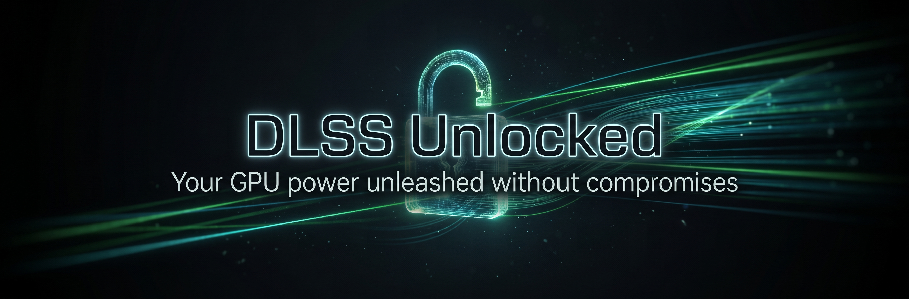

# DLSS-Unlocked

[](https://github.com/ShyVortex/dlss-unlocked/actions/workflows/build-installer.yml)

Unlock **DLSS 3 Frame Generation (DLSS-G)**, **Multi-Frame Generation (MFG: 2X, 3X, 4X)**, and **Neural Rendering (DLSS-NR)** features across NVIDIA GeForce RTX 20xx / 30xx / 40xx GPUs in DirectX 12 games. Fully compatible with **Windows** and **Linux (Proton)** out of the box.

<p align="center">
  
</p>

---

## ⚠️ Requirements
- DLSS and DLSS-G dll files from NVIDIA Streamline v310.8 onwards: `nvngx_dlss.dll`, `nvngx_dlssg.dll`
- DLSS-NR library file (Streamline v310.8 onwards), patched to work with RTX 20xx and 30xx series GPUs: `nvngx_dlssnr.dll`
- Game that natively supports DLSS Upscaling and DLSS Frame Generation

## ✨ Features

- **Multi-Frame Generation (MFG):** Generate multiple interpolated frames (2X, 3X, 4X) via DLSS Enabler's headless frame generation pipeline.
- **DLSS-G Frame Generation Bridge:** Seamlessly translates NVIDIA Streamline DLSS-G calls to AMD FidelityFX FSR 3.1 Frame Generation (via Nukem9 mod & OptiScaler).
- **Neural Rendering (DLSS-NR):** Full support for Dagherbou's OptiScaler_DLSSNR upscaling backend and forwarder.
- **Linux / Proton Support:** Clean modular layout without recursive driver deadlocks.
- **Dual Release Format:** All-in-one automated Setup installer (`.exe`) and clean standalone manual archive (`.zip`).

---

## 📦 Download & Installation

Get the latest release from the **[Releases](../../releases)** page.

### Option A: Automated Installer (`.exe`) — Recommended for Windows
1. Download `dlss-unlocked-setup-*.exe`.
2. Run the installer and browse to your game's executable directory (e.g. `C:\Games\YourGame\bin\x64`).
3. Complete the installation wizard.

### Option B: Standalone Package (`.zip`) — Recommended for Linux / Manual Installs
1. Download `dlss-unlocked-standalone-*.zip`.
2. Extract the contents directly into your game's executable folder alongside the main game `.exe`:
   - **Root folder:** `version.dll`, `OptiScaler.ini`, `nvngx.dll_dlssnr.dll`
   - **`OptiScaler/` folder:** Companion modules (`dlss-enabler-headless.dll`, `dlssg_to_fsr3_amd_is_better.dll`, `nvngx.ini`, FidelityFX, XeSS, registry bypasses)

---

## 🎮 Supported GPUs

- NVIDIA GeForce RTX 20xx / 30xx / 40xx

---

## 🚀 Automated CI Builds

This repository automatically tracks and synchronizes with upstream [OptiScaler_DLSSNR](https://github.com/Dagherbou/OptiScaler_DLSSNR):
1. Checks for new releases every 3 hours.
2. Packages the latest upscaler binaries, neural rendering forwarders, and companion libraries.
3. Automatically builds and publishes both `.exe` installer and `.zip` standalone manual packages on new releases.

---

## 🛠️ Building Locally

To build the standalone package or installer locally:

```powershell
# 1. Download latest OptiScaler_DLSSNR and package standalone zip
.\build-optiscaler.ps1 -DownloadLatest -CreateStandaloneZip

# 2. Compile Inno Setup installer (requires Inno Setup 6.2+)
# Open "DLSS unlocked.iss" in Inno Setup Compiler and click Build
```

---

## Known Issues
Some recent DX12 games may crash under Linux when opening the OptiScaler overlay.
This can be fixed by setting the following variable to true in OptiScaler.ini:
`OverlayMenu=false`

## 📜 Credits

- **[DLSS Enabler](https://github.com/artur-graniszewski/DLSS-Enabler)** by Artur Graniszewski
- **[OptiScaler_DLSSNR](https://github.com/Dagherbou/OptiScaler_DLSSNR)** by Dagherbou
- **[OptiScaler](https://github.com/cdozdil/OptiScaler)** by cdozdil
- **[DLSSG to FSR3](https://github.com/Nukem9/dlssg-to-fsr3)** by Nukem9
- **[DLSSSpoofer](https://github.com/nitrog0d/DLSSSpoofer)** by NitroG0d
- **[nvapi-dummy](https://github.com/FakeMichau/nvapi-dummy)** by FakeMichau
- **[d3d12-proxy](https://github.com/cdozdil/d3d12-proxy)** by Nitec
